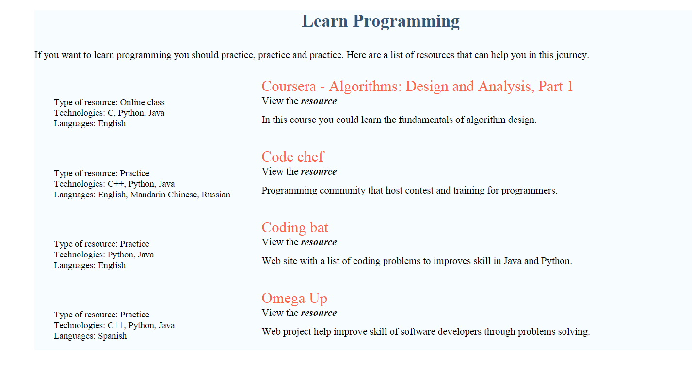
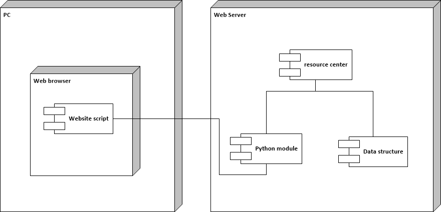

# Learn programming

This is a website that lists several resources that could help to improve your skills as a software developer. 

### Features

- Written in Python 2.7
- Easy to use
- Works with Windows

### Project structure

This project consist of three files:

- resources_center.py, this file has all the information of the website:  name, description, languages, technologies and url of each learning resource.

- data_structure.py, here is defined a class that contain the data structure of each resource.

- fun_list.py, this module takes the information of all resources,  adds style and creates a web page. 

### How to use this code

The main file of this project is _resources_center.py_.
 
To run this project you need to open a terminal and then navigate to the project directory. From there you can run the command `python resources_center.py` this will generate the file _learning\_programming.html_ that you can open in your browser to see all the resources. 
